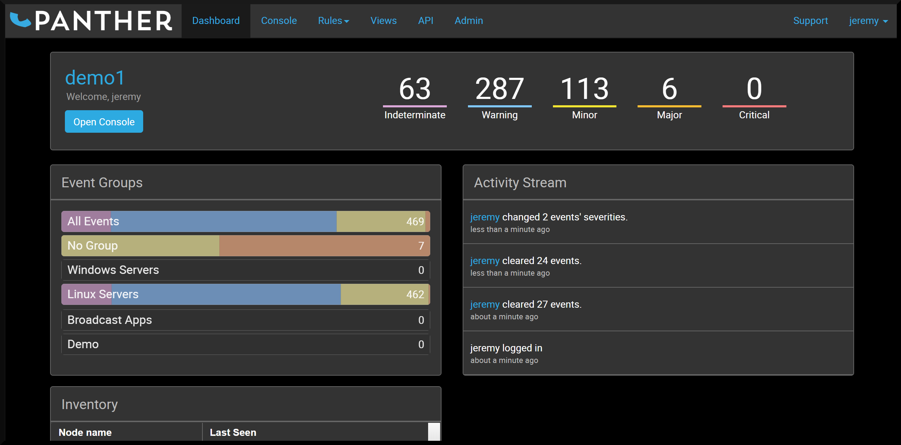
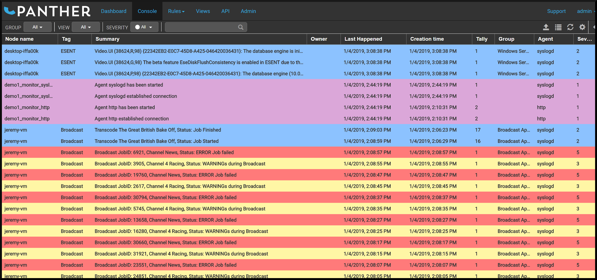
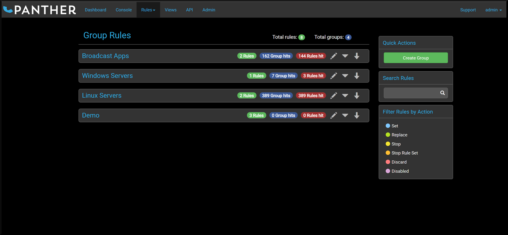
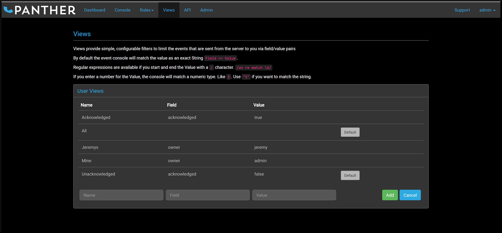
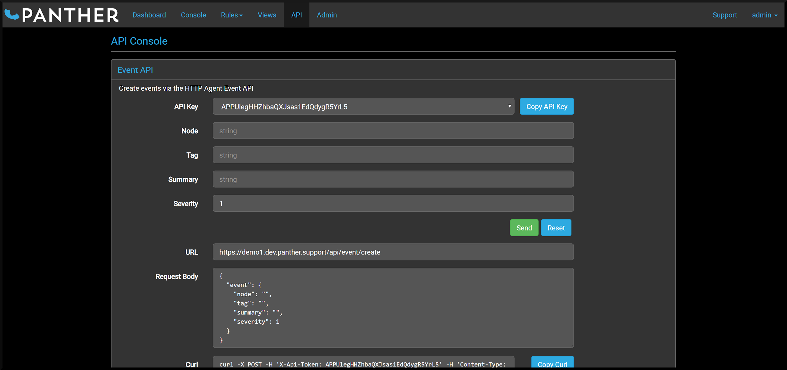
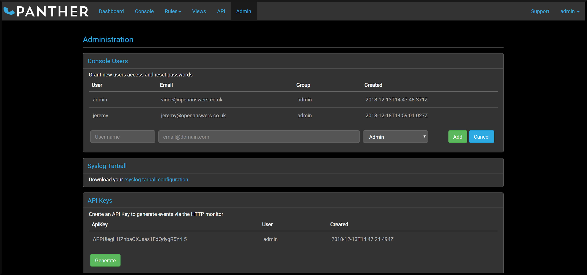

---
# Feel free to add content and custom Front Matter to this file.
# To modify the layout, see https://jekyllrb.com/docs/themes/#overriding-theme-defaults

layout: home
title: Home
nav_order: 0
permalink: /
layout: template
description: Welcome to Panther
---

**Panther** is an event consolidation and management application that centralizes and manages events from IT systems, networks and applications in a single console. Support and Operations teams benefit from increased efficiency and speed to problem resolution by being able to quickly and easily identify the monitoring events that are most important.

Use the Panther [Console](./panther/console/index.md#overview) and [Rules](./panther/rules/index.md#overview) to filter, acknowledge, group, enrich, de-duplicate, aggregate, categorize, assign ownership and manage events through an (ITSM) Event Management lifecycle. Events can be securely sourced and processed from any Syslog source and/or via the Panther [API](./panther/api/index.md#introduction).

_Watch your Events like a Panther!_

# IT Support - First Line Operations
defintion: **Event**
  /ɪˈvɛnt/
  _noun_
  `a thing that happens or takes place, especially one of importance.`

_Something has just happened:_ High performing IT Support teams are able to quickly respond to _events_ by being able to answer these questions quickly:

* What does it mean?
* How important is it?
* Does action need to be taken?
* Who is owning it?
* If it happens again, do I want to know about it?

This is achieved by having clear **visibility** of what needs actioning and being able to adapt to change - **quickly** and **continuously**.

* [ITSM Event Management](./panther/about/index.md#itsm-event-management)
* [ITSM Incident Management](./panther/about/index.md#itsm-incident-management)

# Panther Key Features
## Dashboard
 * Summary
 * Inventory
 * Activity Stream

 * [Dashboard Documentation](./panther/dashboard/index.md#overview)

## Console
 * Event Management
 * Assign
 * Add Notes
 * Modify/Clear
 * Create rule from event

 * [Console Documentation](./panther/console/index.md#overview)

## Rules
 * Global/Group
 * Enrich
 * De-Duplicate
 * Filter/Categorize
 * Prioritize
 * GUI Rule builder

 * [Rules Documentation](./panther/rules/index.md#overview)

## Views
 * Simple, configurable filters via field/value pairs

 * [Views Documentation](./panther/views/index.md#overview)

## API Console
 * Create first events using API

 * [API Documentation](./panther/api/index.md#introduction)

## Admin
 * Users
 * Syslog config
 * Certs and Keys
 * API Keys

 * [Admin Documentation](./panther/admin/index.md#introduction)