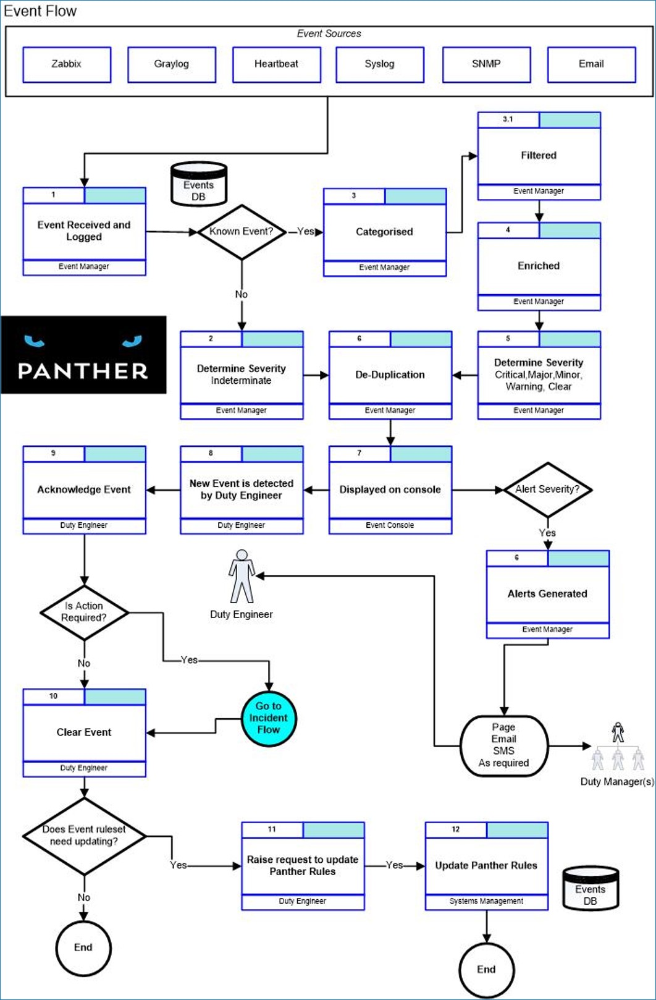
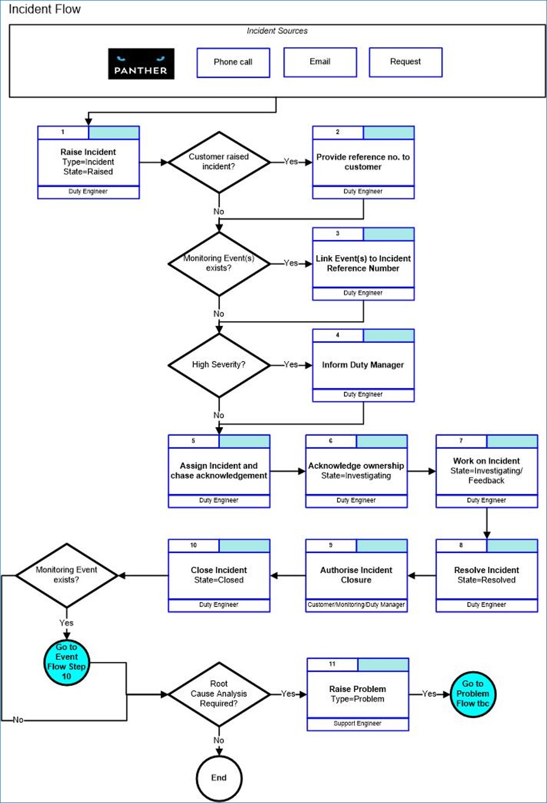

## Background
Panther has been designed and developed by [Open Answers](https://www.openanswers.co.uk/) to meet our operational needs and those of our customers, having provided support and system monitoring services over three decades.

Within the open source and SaaS monitoring space there are myriads of monitoring tools available. The typical monitoring toolset implements **active** monitoring, where the status of a component is checked or a synthetic transaction is tested repeatedly on a schedule. The outcome of that probe/status check/transaction etc is an **active** monitoring event.

A **passive** event is an event of interest within an application or system that is generally triggered by real system or user behaviour. See some [Example Events](#example-events ).

The typical IT operational support team needs an event management platform in its toolset - a console and dashboard where events of all kinds can be aggregated, managed and assessed - all configured through simple rules that help support teams decide what the priority events are and where action needs to be taken.

In a constantly changing IT support environment, the take-on of new applications and systems to support means that it is not possible to predict what kind of events (logged messages, errors, exceptions etc) may occur during day to day operations. To deal with this uncertainty, effective support teams will devise ways to ensure that events generated by critical systems and applications are checked regularly, or as soon as they occur.

The open source and SaaS monitoring tools landscape is lacking when it comes to monitoring events in this way. There has traditionally been a very limited choice of expensive and difficult to implement “Enterprise” event management tools of this type that may be categorised as “manager of managers”. More recently, Log Management tools have appeared on the market which provide a way to aggregate and search historical log information. These are effective for investigating issues but have the limitation that they are not efficient for use in [first-line support scenarios](../).

By surfacing events of all types in one place, in a way that makes them easy to manage, Panther provides the perfect complement to System Monitoring, Log Management, Time-series database and Ticketing tools.

### Example Events

| Event Type             | Example                                                    |
| ---------------------- | ---------------------------------------------------------- |
| Business Event         | Customer unable to make a purchase                         |
| Operating system event | Filesystem is full                                         |
| Operational event      | Scheduled job finished unsuccessfully                      |
| Security event         | Suspicious behavior detected by Intrusion Detection System |
| Application event      | Application generated exception                            |
| Hardware event         | UPS battery low                                            |
| Network event          | Switch detected spanning-tree loop                         |

## Architecture
The (beta) cloud-based version of Panther is a service that ingests events received from TLS-secured authenticated sources using the Syslog protocol or Panther [API](../api/index.md#introduction). The [Console](../console/index.md#overview) provides a rich set of features that allow you to manage events and configure the service using a web browser.

## ITSM Event Management
Thousands (or millions) of events happen across your IT infrastructure every day. Why? Because an event is simply a change to the state of an IT service or configuration item (CI) that is significant to its management.

A server moving from online to idle could be an event, or the completion of a regular server maintenance script, or even an unexpected state at the end of a transaction. **They’re worth knowing about**, and there may even be an **action you wish to take as a result**.

The objective of event management is to detect events, analyse them, and **determine the right control action (if any)**. By doing so, the event management process also provides a strong foundation for service assurance, reporting, and service improvement.

It’s important to know, though, that monitoring and event management are not the same thing. Monitoring is certainly a component of event management, in that it is a useful way to detect events as they occur. Event management, on the other hand, is focused on **extracting meaning out of events, to help IT take appropriate actions** (when required).

Panther is a monitoring tool that enables your IT service management Event Management process.

Open Answers Event Management Flow:

## ITSM Incident Management
In IT service management (ITSM), an Incident management process ensures that normal service operation is restored as quickly as possible and the business impact is minimized after an unplanned interruption or reduction in quality to an IT service, or an event that could increase the risk of this happening. All incidents are events, but not all events are incidents.

Event and Incident management activities performed by First line support personnel will frequently overlap when they involve the diagnosis, identification, logging, categorisation, prioritisation of incidents.

Panther is a monitoring tool that enables your IT service management Incident Management process.

Open Answers Event Management Flow: 

## Note
ITIL® is an acronym that is often used in reference to describing IT service management practices. The term ITIL® should only be used to describe AXELOS' proprietary form of IT service management.

Previously owned by the Cabinet Office, ITIL® and IT Infrastructure Library® are now Registered Trade Marks of AXELOS Limited.