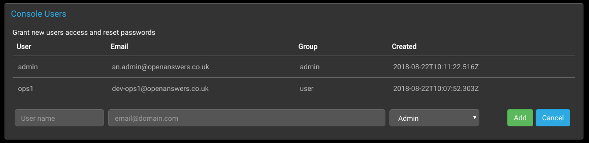
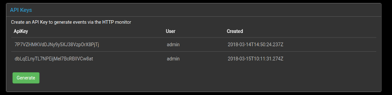

## Introduction

Users who are members of the "admin" group may carry out
administration tasks from the `Admin` page accessed from the main
navigation bar at the top of the Panther screen.

## User Administration

There are two groups of users supported by Panther -- "Admin" and
"User".  Both can be used to login to the application, view the
recorded data, and carry out most associated actions, but members of
the "Admin" group may additionally:
 + add more users
 + download the rsyslog configuration and TLS certificates
 + create API Keys

The user created during the signup process will automatically be an
"Admin" user, who may then go on to carry out any further
configuration and create any more user accounts that may be required.

### Creating User Accounts

New users may be added by completing the user name and email address
input fields in the `Console Users` section of the administration
page. Once a group has been selected and the `Add` button clicked, a
link will be sent to the new user via email for them to use to set
their password.

### Modifying User Accounts

A menu to edit user accounts can be displayed by clicking on an entry
in the list of `Console Users`.

#### Deleting Users

To delete a user, click on the user in the users list to display the
account control buttons, and then click the `Delete` button.

#### Changing Email Addresses

To change a user's email address, click on the user in the users list
to display the account control buttons, type the new email address
into the `Email` input field, and then click the `Save` button.

#### Resetting Passwords

To reset a user's password, click on the user in the users list to
display the account control buttons, and then click the `Reset
Password` button to send a password reset link via email to the user's
configured address.

## API Keys

Panther also offers [an API](../api/) to import event logs.

For security, registered users must supply unique keys when using this
method to transfer data to Panther.

Keys are generated simply by navigating to the `API Keys` section and
clicking the `Generate` button.

See [the API documentation](../api/) for more information.

## Delete All Events

TODO

## Integrations

TODO

## Console Fields

TODO
