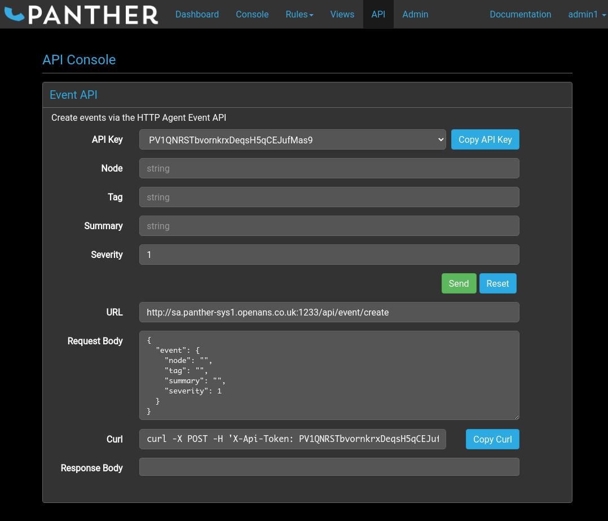
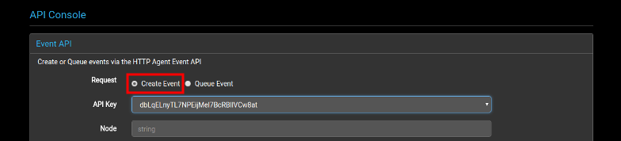
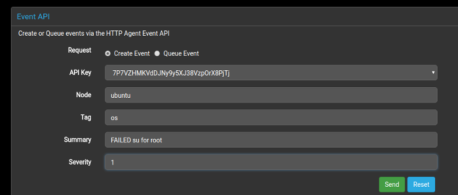
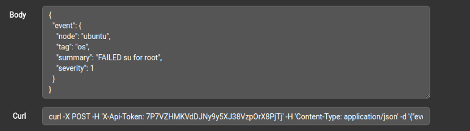
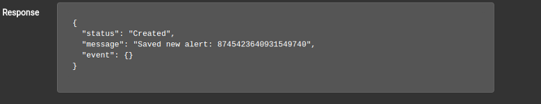
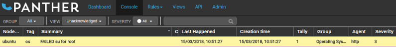

# Introduction

The API Console is a straightforward way to begin using the Panther
API to submit event logs over HTTP.

The purpose of the page is to allow the supported API fields to be
manually input and then automatically formatted into the JSON
structure required by Panther. The result may then either be submitted
to the application from the page or copied into another utility, such
as [curl](https://curl.haxx.se/) - for which an example input is
generated at the bottom of the page.

# Creating an Event

To prepare a new event definition for transmission to Panther, fill in
the input fields in the top section of the `Event API` box.

## API Key

For security, the API requires a valid API key in order to accept
event data. These can be generated by users in the administration
group from [the admin page](../admin#api-keys).

The API key input field is a drop-down list that contains the
currently available keys.

## Node

The node is the host name that will be applied to the event log.

## Tag

The tag is a name used as meta-data to identify and distinguish
between different applications on the same host, or any other similar
purpose.

## Summary

The summary contains the message body of the event log. It describes
the event that took place, and will give detailed information such as
the error message or any diagnostics. It can also contain specific
pieces of data about the event, such as the number of retries a failed
login attempt was made.

## Severity

The severity indicates how important the event log is, and can range
from 0 (clear) to 5 (emergency).

# Sending an Event

Once the event fields have been filled in, the event can be sent to
Panther by clicking on the `Send` button. The response will be
displayed in the `Response Body` box at the bottom of the page.

Alternatively, events can be sent using a different application by
submitting the message displayed in the `Request Body` box as POST
data to the address displayed in the `URL` box. One common method
would be to use the example [curl](https://curl.haxx.se/) command line
shown in the `Curl` box.

# Example

This example of sending an event log using the GUI on the API page
will also show how the [example group rule](../rules#group-rulse)
works to put a log containing `FAILED su` in its summary into the
`Operating System` group.

1. Select an API key from the drop-down box.
   
    

2. To create an event that will handled by the `Operating System`
group, the `Tag` for the event must be `os` and the `Summary` must
include the string `FAILED su for`. The `Node` can be any string
value, and the severity level can be any value from 0 to 5, because a
new value will be set by the group rule.

    

    Notice that the contents of the `Request Body` and `Curl` sections change as the input fields are set.

    

3. Once fields have been set, click the `Send` button. The `Response
Body` section will update with the reply from Panther, indicating
whether the request was successful or if there was a problem.

    

4. If all went well, the new entry should be in the console along with
all the other event logs.

    

If the the custom group rule has been applied, the group will be set
to `Operating System` and the severity will be set to `3` - which is
also shown by the entry being displayed in yellow.

