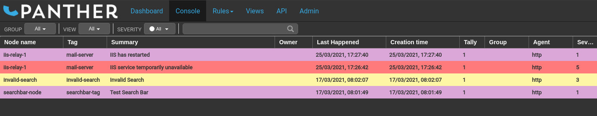

# Overview

The console is the main feature of Panther. It contains the system event logs, which are filtered and categorized based on account settings.

There are numerous options for interacting with the events, such as deleting them, expanding them to display more information, or assigning them to specific users.

These options are explained in more detail below.

## Events

To interact with one or more events, first select them using one of the following methods:

 * Click on a single event to highlight it.
 * Click hold and drag (like drawing a box) to highlight many events.
 * Control click to add another single event to your selection.
 * Shift click to add a sequence of events to your selection.
 * Press keyboard shortcut <kbd>ctrl</kbd>+<kbd>a</kbd> to select all events.

Right click to display the context menu of actions available for the selected events as outlined below.

### Acknowledge and Unacknowledge

New events will be in an unacknowledged state by default, displayed in bold text, unless a [rule](../rules/index.md) has been set that says otherwise.

When an event is acknowledged from the right click menu, it will automatically be assigned to the user.

Users can also acknowledge and unacknowledge events from the [event details](#event-details) dialogue box.

### Add External ID

TODO

### Add Note

TODO

### Clear

Clearing sets an event to be removed from the console. Cleared events will be highlighted green for a time, so other users can be notified, until a background task deletes them.

### Assign

Events can be assigned to console users, who can then see them in the [view](../views/index.md) page under the `Mine` user view.

### Severity

The severity levels of events can be changed to different values by selecting new ones from the provided menu options.

### Details

TODO

### Copy Event

The summary details of the selected events can be copied into your local system's copy buffer for pasting into other applications.

### Tools

TODO

## Event Details

A dialogue box containing more detail of each event can be displayed by double clicking the event or pressing the enter key while an event is selected.

In addition to the details available in the dialogue box, all actions in the console's right click context menu are also available as buttons along the bottom. Along the top is a row of tabs providing access to further information, as outlined below.

### Details

The `details` tab provides an overview of the event, including a graph of up to 1000 of the event's previous occurrences.

### Notes

Text notes can be added to events for further reference, which can also be seen by other users.

### History

Any activity that has occurred on the event can be seen in the `history` tab. This will include any [rules](../rules/index.md) that have been used during the event processing, and any actions taken by users from the console.

### Fields

All data associated with events may be inspected on the `fields` tab.

### Matches

The `matches` tab reports whether the events match any global or group [rules](../rules/index.md).

## Activity

Recent user activity can be displayed by expanding the activity sidebar from the top-right corner of the console screen.

## Filters

The top-left corner of the console contains a row of filters which may be applied to display events matching a number of criteria.

### Group

Selecting a group from the drop-down menu will filter all events to just the group set up in the user's [rules](../rules/group.md).

There are two special groups -- `All` will display every event and `No Group` will display any events that have not been categorized.

### View

Views allow event fields to be queried for particular data and only matching events to be shown in the console.

By default, the `All`, `Mine`, `Acknowledged` and `Unacknowledged` views are already available.

### Severity

Selecting a specific severity will filter the console data to only contain events matching the required value, while `All` will include everything.

### Multiple Filters

It is possible to select all the filters at the same time in order to monitor specific kinds of events.

For example, it is possible to view all critical alerts that are assigned to a particular user and match the rules for a configured group.

