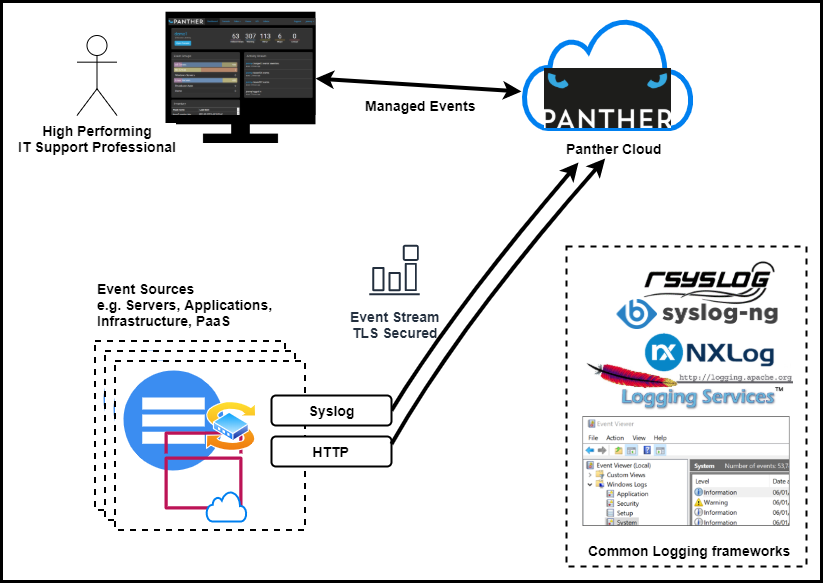
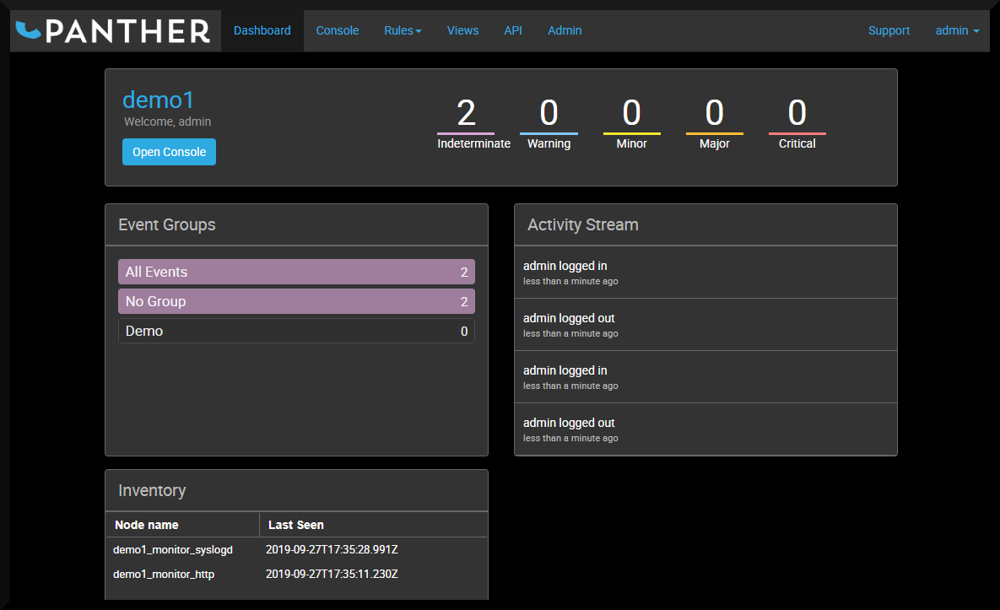
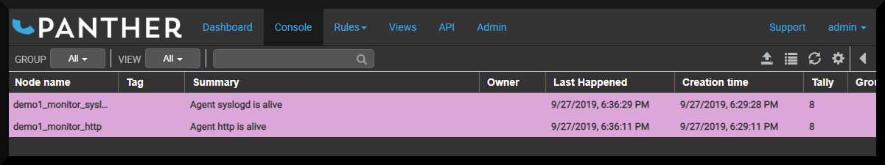
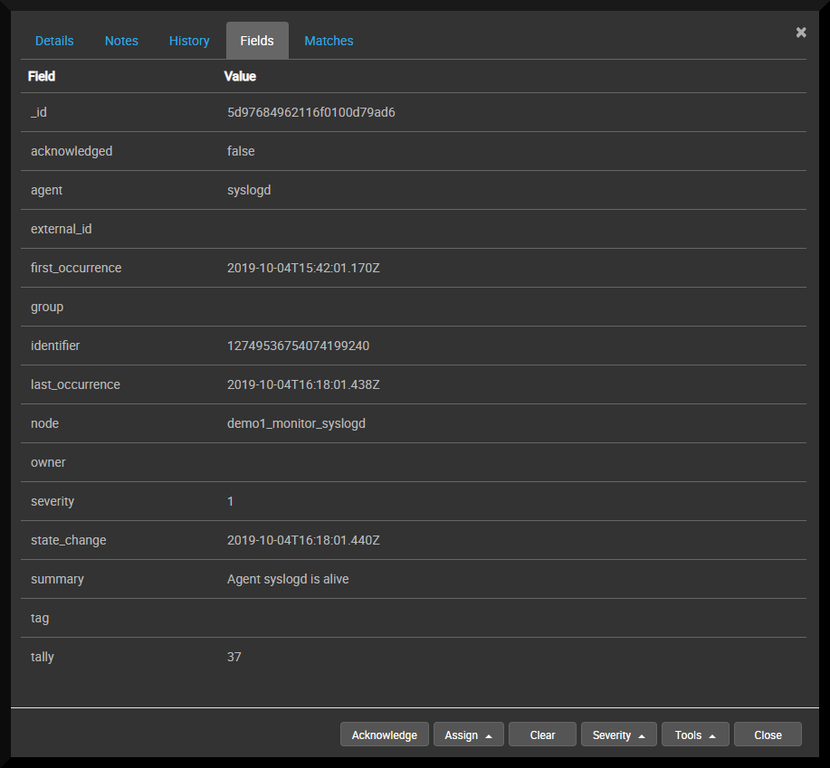

# Introduction
The (beta) cloud-based version of Panther is accessible at [app.panther.support](//app.panther.support). After a simple Sign-up process your dedicated secure Panther instance will be automatically provisioned within the Panther Cloud. When signing-up you will be asked to choose a unique name for your Console which will then be accessible at https://{**your-console-name**}.[app.panther.support](//app.panther.support).



## Using Panther for the First Time

### Logging in (SaaS)
Login for the first time as the `admin` user using the password you gave during Sign-up - this is the default user account that will be used to [administer](../admin/index.md) Panther for the first time.

### Logging in (`docker-compose.yml`)

**Note** Instructions for launching the Docker images are on [github.com/openanswers/panther-core](https://github.com/OpenAnswers/panther-core)

After starting the Panther containers for the first time an initial password will have been set. Unless configured that defaults will be:

| Username | `admin` |
| Password | `admin`|

This can be changed through the `environment` settings in [`docker-compose.yml`](https://github.com/OpenAnswers/panther-core/blob/master/docker-compose.yml) e.g.

```yaml
  event-console:
    ...
    environment:
      - ADMIN_USERNAME=admin
      - ADMIN_PASSWORD=admin
      - ADMIN_EMAIL=you@example.com
```

### Welcome to the dashboard

The first screen that you will see is the [Dashboard](../dashboard/index.md#overview), which will look like this:



Clicking on `Open Console` will take you to the [Console](../console/index.md#overview), which will look like this:



... this example shows that the Panther instance currently has two events in it. These particular messages are coming from the instance's _internal_ `syslogd` and `http` agents which will send periodic "keep-alive" events to indicate that they are healthy. Here, `Agent http is alive` and `Agent syslogd` are the details of the event, contained within the `summary` field (see next section). Double-click on an event to explore it a bit more.

## Anatomy of an Event
A Panther Event is comprised of a number of data fields that are analagous to [The Syslog Protocol](https://tools.ietf.org/html/rfc5424).

| Field            | Meaning                                                         | Example value                                                                     |
| ---------------- | --------------------------------------------------------------- | --------------------------------------------------------------------------------- |
| _id              | Internal Panther ID for the event                               | `5d8a4143f9f0b20100f778f9`                                                        |
| acknowledged     | Indicates whether the event has been acknowledged               | `false`                                                                           |
| agent            | The agent that received the event                               | `syslogd`                                                                         |
| external_id      | A reference to an external identifier (e.g. incident reference) | `OA:12345`                                                                        |
| first_occurrence | Date/time when the first event was received                     | `2019-09-24T16:16:03.825Z`                                                        |
| last_occurrence  | Date/time when the last event was received                      | `2019-10-04T12:22:49.063Z`                                                        |
| group            | Grouping applied to this event (determined by Group Rules)      | `Windows Servers`                                                                 |
| identifier       | Unique identifier for this event (used for de-duplication)      | `10740737389554512696`                                                            |
| node             | Hostname of the device/server that originated the event         | `MYWINSERVER123`                                                                  |
| owner            | The panther user that has taken ownership of this event         | `dave`                                                                            |
| severity         | Event Severity (0-5)                                            | `5` _(Warning)_                                                                   |
| state_change     | Date/time when the last change to the event occurred            | `2019-10-04T12:22:49.066Z`                                                        |
| summary          | Event details                                                   | `ERROR_OUTOFMEMORY: Not enough storage` `is available to complete this operation` |
| tag              | Name of program or process that generated the event             | `Microsoft-Windows-Kernel-General`                                                |
| tally            | Count of event occurrences                                      | `1416`                                                                            |

By default, a unique Event is defined by the combination of the fields: `{node}:{severity}:{tag}:{summary}`.

Multiple events that have the same values for these fields will be treated as the same event, with a counter (`tally`) incremented for each occurrence. Simple [Rules](../rules#overview) can be used to adjust the contents of these fields (for example, to remove unique data from the `summary` field) which allows Events to be __de-duplicated__ and __enriched__, making them easy to manage.

Double-click on an event and select `Fields` to see its full contents:




See also:
 * [Syslog Mappings](../rules/#syslog-mappings)

# Set Up Event Sources

There are currently two main methods to import event logs into Panther
from client event sources. The most straightforward of these is by
means of compatible logging software, while an HTTP based API is also
available for integration with bespoke client applications.

## Logging Software

Panther offers the capability to receive event logs directly from
supported third-party logging software.  In order to facilitate this,
archives of configuration files are available for download from the
Panther `admin` page.

More detailed information on the download procedure is available,
along with configuration guides for each supported system, in the
[client configuration section](../config/index.md).

## REST API

For use cases where programmatic control is needed over the submission
of event log entries, Panther provides an HTTP based REST API,
incorporating a key for security.

More details on this are available in [the API section](../api/index.md).

## Graylog (future)

## SNMP Trap (future)

# Event Source Examples

The freely available software packages listed below can act as event
sources for Panther.

| Software                                                          | Official Website                                               | Panther Configuration                                              |
| ----------------------------------------------------------------- | -------------------------------------------------------------- | ------------------------------------------------------------------ |
| {:height="30px" width="80px"}     | [Documentation](https://nxlog.co/documentation)                | [Linux](../config#nxlog-linux), [Windows](../config#nxlog-windows) |
| {:height="30px" width="80px"} | [Documentation](https://www.rsyslog.com/doc/master/index.html) | [Linux](../config#rsyslog-linux)                                   |
| Syslog-ng                                                         | TODO                                                           | TODO                                                               |
| Log4j                                                             | TODO                                                           | TODO                                                               |
| Log4Net                                                           | TODO                                                           | TODO                                                               |

Examples of approaches that can be used to monitor infrastructure and applications.

| Technology                 | How  |
| -------------------------- | ---- |
| Linux                      | TODO |
| Windows                    | TODO |
| Cisco                      | TODO |
| MuleSoft Anypoint Platform | TODO |
| Dell Boomi                 | TODO |

# Configure a Global Rule

Global rules are rules that will be applied to every event log that is received by Panther. By default, you will have some syslog rules and a simple example. There is a tutorial for adding further global rules in the [Rules](../rules/global.md) section.

# Configure a Group rule

There is a tutorial on setting up group rules in the [Rules](../rules/group.md) section, along with a working example in the [API](../api/index.md#example) section.
