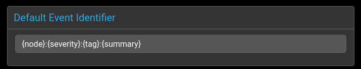
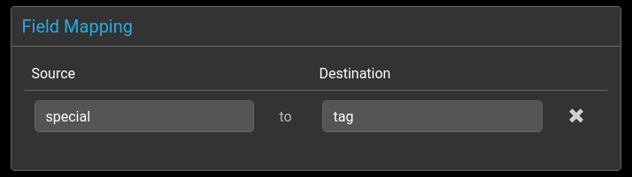

# Overview

There are two Panther event receivers:
 - Syslog
 - HTTP

Events flow throught the each agent before being processed by the [global](../rules/global.md) and [group](../rules/group.md) rules.

@startuml

"Default Event Identifier" -right-> "Field Mapping"
-right-> "Agent Specific"
-right-> "Field transformations"

@enduml

# Agent Rules

These are common to all agents

## Default Event Identifier

  

The event's `identifier` field uniquely identifies an event in the console.

By default this is created by combining the node, severity, tag and summary fields: 

  `{node}:{severity}:{tag}:{summary}`

Any events with a matching identifier will be grouped together, and
the corresponding event `tally` will increase by 1.

If no matching event identifier is found, then a new event is created.

Timestamps are also stored for each event.

**Please note** that when events are deduplicated via the `identifier` field, some information may be lost. 
For example, the PID of a process can change regularly, but is not included in the identifier by default, so multiple PIDs may aggregate into a single event.

## Field Mapping

## Field Transformers

The transforms allow pre-defined functions to be applied to event
console fields before rules processing takes place.

Currently supported transformations are

|Lower Case| lowercases a field value|
|Upper Case| uppercases a field value|
|Left Trim| Trims whitespace on the left|
|Right Trim| Trims whitespace on the right|

# Agent Specific - Syslog

Syslog message fields need to be mapped to event console fields. These fields
will then be available for matching in rules processing.

## Severity Mapping

Syslog logging levels need to be mapped to event console severities as
there is not a one to one relationship between them, and the scale is
also inverted.

Syslog levels are defined from 7 (debug) to 0 (emergency).

Panther severities are from 5 (critical) to 0 (clear).

By default, events with severity 0 will be periodically removed from the list of
event logs in the console.

# Agent Specific - HTTP
TODO