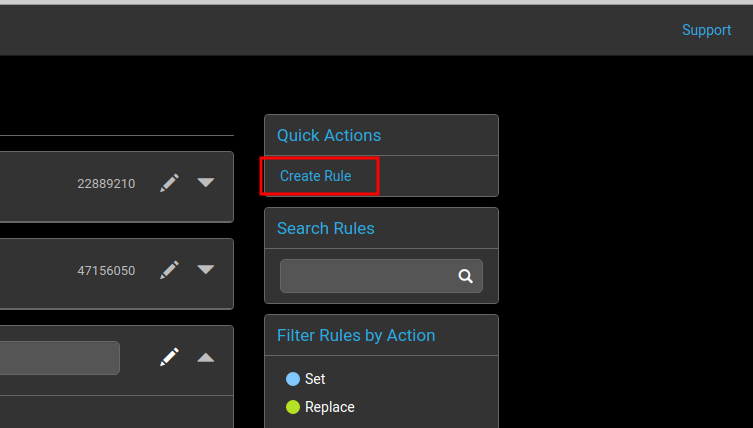
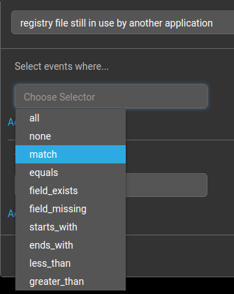
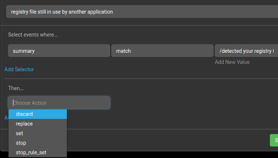
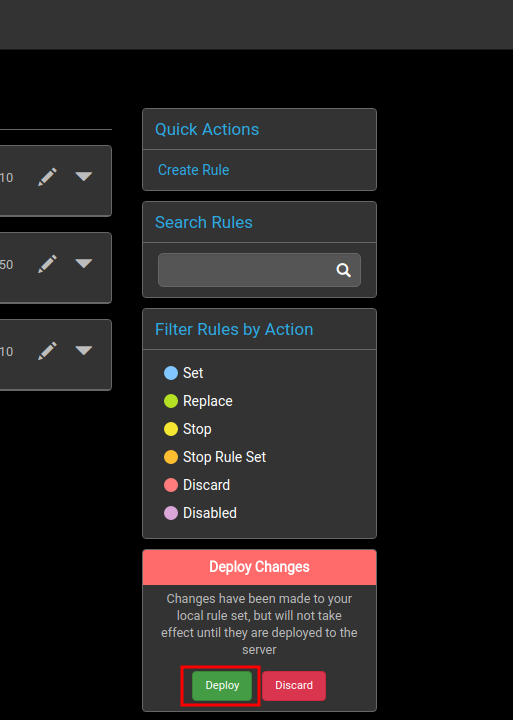

# Global Rules

Global rules are applied to every event that is parsed into
Panther. These would be common rules intended to apply to most if not
every group.

An example would be a global rule to discard any events that are sent
in due to the registry file being in use by another application or
service.

To implement this example:

1. Create a new rule
   
    

2. Enter a name for the rule and choose a selector from the drop down
menu. In this case, use `match` to check for a string in the summary
of the event.

    

3. Select a field, in this case the summary field of the log event.

4. Enter the string to match the field with in the summary. In this
case, the message is `/detected your registry/`.

5. The action to select is to delete the event log from the console.

    

6. Save the new rule and click deploy to forward the changes to the server.

    

