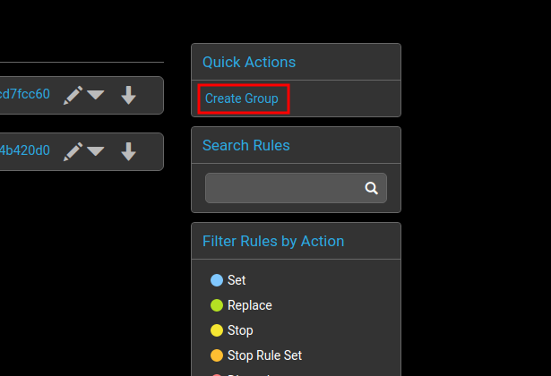
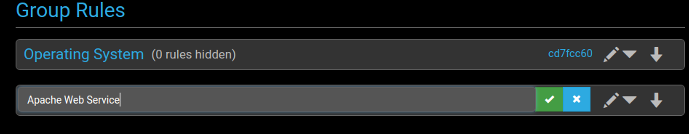
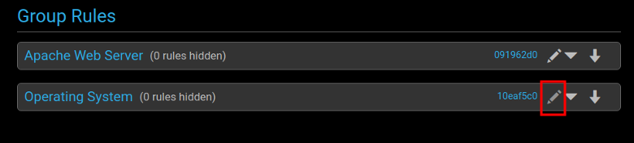
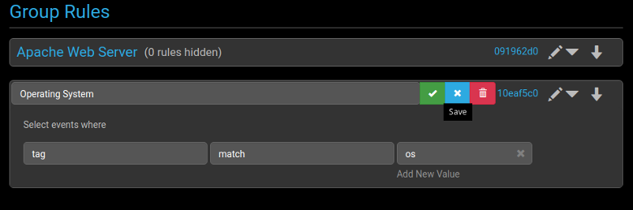
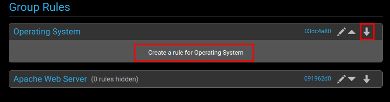
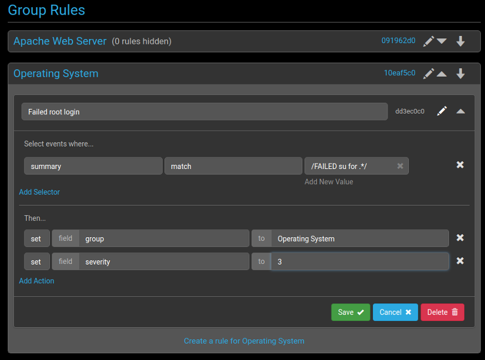
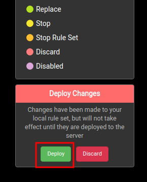

# Group Rules

Group rules are used to sort the event logs into different groups,
based on user discretion.

An example of this would be splitting the events based on the service
type, such as web service or OS. A "web service" group could handle
events related to Apache, such as downtime for example, and an "OS"
group could handle events such as system crashes. Sorting the event
logs into groups such as these can help maximize efficiency by sending
them to the relevant teams.

To create a new group rule:

1. Create a new group

    

2. Enter the name of the group you want to make. In this case there
are two groups -- one named Operating System and one named Apache Web
Service.

    

3. To match any event log with this group, set a rule in the group
selector. In this case, the rule is going to check the tag of the
event log for the string `os`. Once this match has been found, it will
run through the rules in the group one by one against the event log
entry, carrying out any processing required.
To do this, click on the pencil to open up the group selector.

    

4. Create a rule to match the tag field with the word `os`, and save it.
  
    

5. The new group selector can now match event logs containing the
`os` tag against any rules in the group.  To create a new rule for the
group, click on the down arrow for it and select 'Create a rule
for...'

    

6. This section is very similar to the `Global Rule` section. In this
example, create a rule to log and group any failed `su`
authentication events.

    
    This rule is sending any event log that contains the string `FAILED su for .*` to the Operating System group and setting the severity to 3.

7. Click `Save` and enable the deployment to the server.
   
    

An example of this group rule being used is shown in the
[API](../api#example) section.

