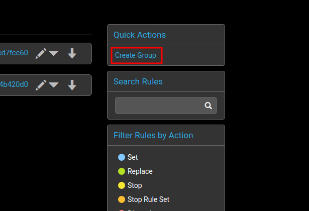
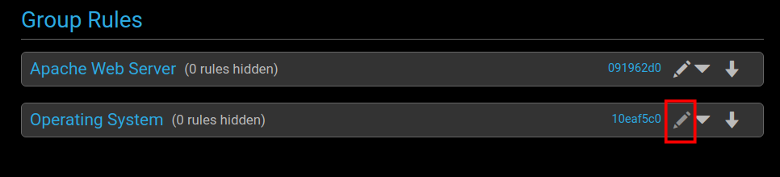
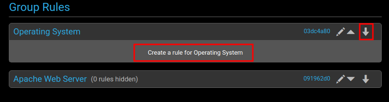
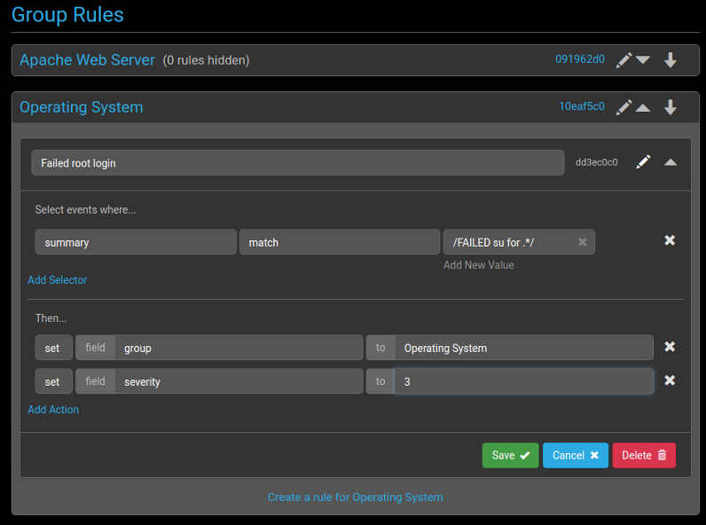
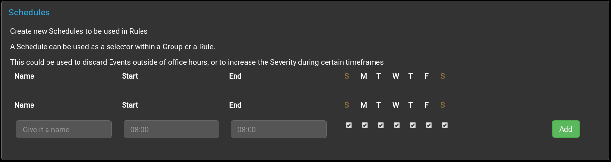

## Overview

Rules control how log messages are turned into events. They can be
used to discard, de-duplicate or modify the events that appear in the
Panther console.

Events are received from an external source, processed by user defined
rules, and finally stored on the Panther server.

@startuml
cloud "event source" as c1
cloud "Panther" as pan {
  agent "Monitor" as mon
  agent "Rules" as rules
  database storage

} 

c1 -right-> mon
mon -right-> rules
rules -right-> storage
@enduml

### Processing order

@startuml
agent "Agent Rules" as a1
agent "Global Rules" as a2
agent "Group Rules" as a3

a1 --> a2
a2 --> a3
@enduml

The set of [Syslog Mappings](#syslog-mappings) are processed first,
followed by the [Global Rules](#global-rules) and, finally, any optional
[Groups Rules](#group-rules).

## Global Rules

Global rules are applied to every event that is parsed into
Panther. These would be common rules intended to apply to most if not
every group.

An example would be a global rule to discard any events that are sent
in due to the registry file being in use by another application or
service.

To implement this example:

1. Create a new rule

2. Enter a name for the rule and choose a selector from the drop down
menu. In this case, use `match` to check for a string in the summary
of the event.

3. Select a field, in this case the summary field of the log event.

4. Enter the string to match the field with in the summary. In this
case, the message is `/detected your registry/`.

5. The action to select is to delete the event log from the console.

6. Save the new rule and click deploy to forward the changes to the server.

## Group Rules

Group rules are used to sort the event logs into different groups,
based on user discretion.

An example of this would be splitting the events based on the service
type, such as web service or OS. A "web service" group could handle
events related to Apache, such as downtime for example, and an "OS"
group could handle events such as system crashes. Sorting the event
logs into groups such as these can help maximize efficiency by sending
them to the relevant teams.

To create a new group rule:

1. Create a new group

2. Enter the name of the group you want to make. In this case there
are two groups -- one named Operating System and one named Apache Web
Service.

3. To match any event log with this group, set a rule in the group
selector. In this case, the rule is going to check the tag of the
event log for the string `os`. Once this match has been found, it will
run through the rules in the group one by one against the event log
entry, carrying out any processing required.
To do this, click on the pencil to open up the group selector.

4. Create a rule to match the tag field with the word `os`, and save it.

5. The new group selector can now match event logs containing the
`os` tag against any rules in the group.  To create a new rule for the
group, click on the down arrow for it and select 'Create a rule
for...'

6. This section is very similar to the `Global Rule` section. In this
example, create a rule to log and group any failed `su`
authentication events.

This rule is sending any event log that contains the string `FAILED su
for .*` to the Operating System group and setting the severity to 3.

7. Click `Save` and enable the deployment to the server.

An example of this group rule being used is shown in the
[API](/api/README#example) section.

## Schedules

Schedules can be used to specify specific times of the week, enabling Rules to only match under those conditions.

The `Name` is used to identify the schedule when editing Rules or Groups.  It must be unique.

`Start` and `End` specify a time range in the format of `HH:MM`. If the `Start` time is after the `End` time then the following conditions shall match:

 + From midnight to the `End` time
 + From the `Start` time till midnight 

Days of the week can be chosen with the checkboxes

 + *S*unday
 + *M*onday
 + *T*uesday
 + *W*ednesday
 + *T*hursday
 + *F*riday
 + *S*aturday

## Syslog Mappings

Syslog message fields need to be mapped to event console fields. These fields
will then be available for matching in rules processing.

### Default Event Identifier

The event's `identifier` field uniquely identifies an event in the console.

By default this is created by combining the node, severity, tag and summary
fields: `{node}:{severity}:{tag}:{summary}`.

Any events with a matching identifier will be grouped together, and
the corresponding event `tally` will increase by 1.

If no matching event identifier is found, then a new event is created.

Timestamps are also stored for each event.

Please note that when events are deduplicated via the `identifier` field,
some information may be lost. For example, the PID of a process can change regularly,
but is not included in the identifier by default, so multiple PIDs may aggregate
into a single event.

### Severity Mapping

Syslog logging levels need to be mapped to event console severities as
there is not a one to one relationship between them, and the scale is
also inverted.

Syslog levels are defined from 7 (debug) to 0 (emergency).

Event console severities are from 5 (critical) to 0 (clear).

By default, events with severity 0 will be periodically removed from the list of
event logs in the console.

### Field Transform

The transforms allow pre-defined functions to be applied to event
console fields before rules processing takes place.

Currently, `#[code lower_case]` is the only transform supported and by
default it is applied to the `node` field, so that case checking is not
necessary.

If you have an idea for a transform you would like added, please let us know.
TODO - really?

### Agent Rules

## HTTP

TODO

## Details

  Each rule definition is stored in yaml file.

  A basic rule has a `name` followed by a *Select* verb, such as `match`, and an *Action* verb, such as `discard`:

      name: 'Rule name'
      match:
        some_field: value
      discard: true

  Multiple *Select*s are interpreted as logical "and" operations.
  This example is equivalent to "*Select* WHERE `some_field` **matches** the regular expression `/value/` AND where `other_field` **equals** `value`":

      match:
        some_field: !!js/regexp /value/
      equals:
        other_field: value

  Multiple *Actions* can be specified too:

      discard: true
      stop: true

  A *RuleSet*, which groups the rules into logical areas, is made up of an array of *Rules*. These are processed in order, until the last rule is found or a `stop` or `stop_ruleset` action is encountered:

      - name: 'Rule name'
        match:
          some_field: value
        set:
          new_field: 17

      - name: 'No junk'
        equals:
          my_field: 'linux'
        set:
          that_field: 'Torvalds'

  There are multiple *RuleSets* used during processing. The *Global* *RuleSet* is processed first, followed
  by any *Group* rules. Only one group will be matched, based on the *Select* verbs, and its rules then processed.

  *Discard* and *Dedupe* are shortcuts for what end up as rules that are placed before the rest of the *RuleSet*.

### Rule Order

Rules are applied in the following order:

  1. Syslog mapping
  2. Global discards
  3. Global de-duplication
  4. Global rules, in order
  5. Grouping, and the group rules. (group_order: if required? TODO - check)
      1. discard_first
      2. dedupe
      3. rules
      4. discard_last
  6. Discards that rely on other mappings

### Shortcut helpers

  There are some tasks that are repeated frequently, so the most
  reqular have shortcuts set up to make the rules more succinct.

  TODO - not clear how or where to use these!

#### `syslog_mapping`

  Takes the syslog levels and maps them
  to console severities.

  * This is a required field (TODO - what is?)

#### `deduplicate`

  Shortcut for matching on `summary` with a regex and replacing it.

     - [ /match/, 'replace' ]

  Or supply a second regex if you want a more specific search replace

     - [ /match/, /replace_match/, 'replace' ]

  * A match will short-circuit dedupe execution, but continue on to
  any following rules.

#### `discard` / `discard_last`

  Shortcuts for dumping messages, either before or after normal
  processing.

  Discard on summary:

      - '/trash/'

  Or write a full rule

      - name: 'To the bin'
        match:
          summary: /trash/

  * Discard will short-circuit execution.

