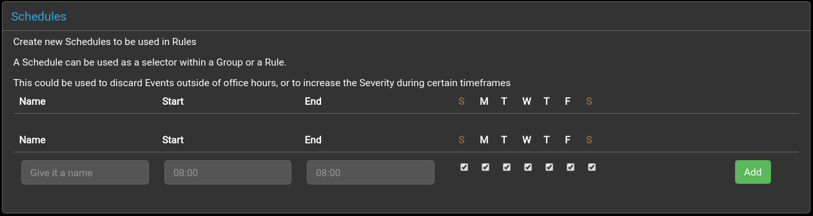

## Schedules

Schedules can be used to specify specific times of the week, enabling Rules to only match under those conditions.

The `Name` is used to identify the schedule when editing Rules or Groups.  It must be unique.

`Start` and `End` specify a time range in the format of `HH:MM`. If the `Start` time is after the `End` time then the following conditions shall match:

 + From midnight to the `End` time
 + From the `Start` time till midnight 

Days of the week can be chosen with the checkboxes

 + *S*unday
 + *M*onday
 + *T*uesday
 + *W*ednesday
 + *T*hursday
 + *F*riday
 + *S*aturday