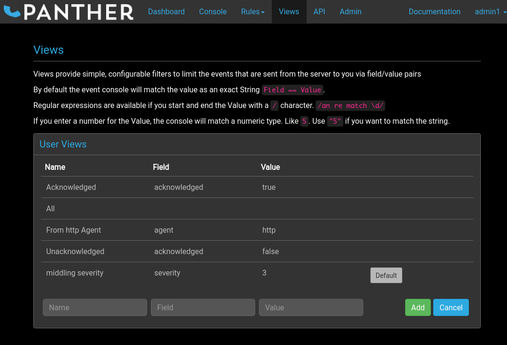

# Overview



Views provide simple, configurable match criteria which may be used
with the [console filters](../console/index.md#view) to narrow down the
events displayed to useful sub-sets. For example, the `Mine` view
provided by default displays events assigned to the current user.

# Adding Views

Views may be added by completing the three input boxes at the bottom
of the `User Views` list and clicking the `Add` button.

All three boxes must be completed, as described below.

## Name

This should be a short text string to be used as an identifier for the
new view. This will be displayed both in the `User Views` list and in
the `View` filter selection drop-down box at the top of the console
page.

## Field

The event field name, chosen from a drop-down list of available data
elements, corresponds to one of the fields shown in the console events
display area. This is the field which must match the specified value
in order to be displayed in the new view.

## Value

The value which the selected field must match in order to be
displayed.

There are three formats available.

### String

The default format is the exact value to match against the field
content as a literal string.

```yaml
    summary: Authentication failure
```

### Regular Expression

Rather than literal string values, regular expressions may be
specified by surrounding them with forward slash characters `/`.

```yaml
    summary: /.*Authentication.*/
```

### Number

Some fields contain numeric values, which may be matched by specifying
straightforward numbers.

```yaml
    tally: 5
```

To match numbers that are in fact strings, surround the required value
in double quotes.

```yaml
    summary: "42"
```

## Deleting a View

Views can be deleted by first clicking on them in the `User Views`
list, then clicking on the red trash icon.

## The Default View

It is also possible to configure a default view for the console page.

To do this, click on the view in the `User Views` list, then click on
the `Set Default` button.

